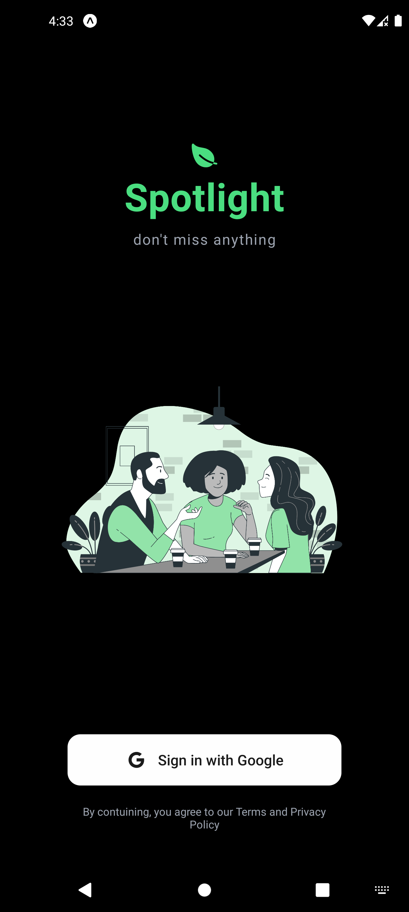

# 📲 InstaClone - Sosyal Medya Mobil Uygulaması

> React Native (Expo), Convex & Clerk kullanılarak geliştirilmiş tam entegre sosyal medya çözümü

---

## ✨ Tanıtım

**InstaClone**, mobil cihazlar için geliştirilmiş modern, performans odaklı ve güvenli bir sosyal medya uygulamasıdır. Kullanıcılar, gönderi oluşturabilir, beğeni ve yorum yapabilir, keşfet ekranında diğer kullanıcıların içeriklerine erişebilir. Arka planda **Convex** ile gerçek zamanlı veri yönetimi sağlanırken, kimlik doğrulama süreçleri **Clerk** ile yönetilmektedir.

---

## 🖼️ Uygulama Görselleri (Canvas / Ribana Vitrini)

> Uygulamanızı **Canvas**, **ProductHunt**, **Dribbble** veya benzeri platformlarda paylaşmadan önce aşağıdaki görselleri `/screenshots/` klasörüne yerleştirin.

  
  
  
  

---

## ⚙️ Temel Özellikler

| Özellik               | Açıklama                                     |
| --------------------- | -------------------------------------------- |
| 🔐 **Clerk Auth**     | Kullanıcı kaydı, giriş/çıkış, token yönetimi |
| ☁️ **Convex Backend** | Gerçek zamanlı veritabanı & veri işlemleri   |
| 🖼️ **Post Paylaşımı** | Fotoğraf, açıklama ile gönderi oluşturma     |
| ❤️ **Beğeniler**      | Gönderilere çift tıklama ile beğeni          |
| 💬 **Yorumlar**       | Gönderilere yorum yapabilme                  |
| 🧭 **Keşfet Sayfası** | Tüm kullanıcıların içeriklerini görme        |
| 👤 **Profil Ekranı**  | Kişiye özel gönderi geçmişi                  |
| 🌐 **Zustand State**  | Global state yönetimi ile performanslı yapı  |

---
